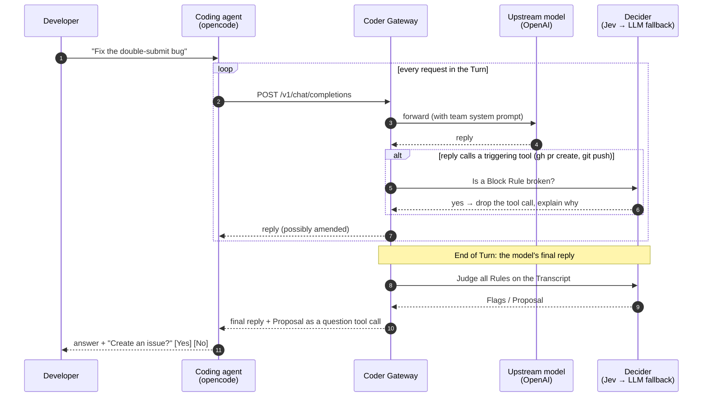

<div align="center">

# Coder Gateway

**Your team has a way of working. Your coding agent doesn't know it. The Gateway does.**

An OpenAI-compatible gateway that sits between a coding agent and the model, follows every
conversation, and steers it towards your team's workflow — without anyone configuring their agent.

[](https://github.com/baswenneker/poc-coder-gateway/actions/workflows/ci.yml)


[](LICENSE)

[Why](#why) · [See it in action](#see-it-in-action) · [How it works](#how-it-works) ·
[Quickstart](#quickstart) · [Write your own rules](#write-your-own-rules) · [Benchmark](#benchmark) ·
[Docs](#documentation)

</div>

---

## Why

Every team has agreements: *work starts from an issue*, *changes follow a spec*, *no pull request
without green tests*. Coding agents happily ignore all of them unless each developer writes the
perfect system prompt, installs the right skills and keeps them up to date.

The Coder Gateway moves that knowledge out of every laptop and into one place. Developers point
their agent at the Gateway instead of at OpenAI. From then on, the Gateway reads along and steps in
only when an agreement is broken:

| | Intervention | What the Developer sees |
|---|---|---|
| 🏳️ | **Flag** | Nothing in the conversation. The broken rule shows up on the dashboard and in the status API. |
| 💬 | **Proposal** | A question under the agent's final reply, with buttons: *"No issue has been mentioned for this work. Shall we create one?"* |
| ⛔ | **Block** | A tool call such as `gh pr create` or `git push` is removed **before it runs**, with an explanation of why. |

The agent, the model and the developer's habits stay the same. The workflow lives in one YAML file
that the team owns.

## See it in action

Real output from an end-to-end run with [opencode](https://opencode.ai) and `gpt-5.4`.

**A Proposal after the work is done** — the Developer asked for a feature without mentioning an issue:

```text
$ opencode run "Add a function power(a, b) to calc.py."
...
Done.
Added `power(a, b)` in `calc.py:12` and a test in `test_calc.py:4`.
`pytest` is green: 3 tests passed.

No issue has been mentioned for this work. Shall we create one so it is traceable? (answer yes or no)
```

**A Block before the command runs** — the model tried to open a pull request without a passing test run:

```text
The Gateway stopped this step: the model wanted to open a pull request or push code, but this
conversation does not show the tests passing after the last change. Run the tests first and show
that they pass; then ask for the pull request again.
```

`gh pr create` never executed. Ask the agent to run the tests, and the next attempt goes through.

## How it works



A few design choices that make this practical:

- **One Decision per Turn, not per request.** A single Developer message often triggers ten or more
  model requests. The Gateway forwards all of them untouched and decides once, on the final reply —
  plus an extra check whenever the model wants to run a command that a Block Rule guards. In a live
  opencode session: 11 requests, 1 Decision.
- **Blocks happen before execution.** The Gateway reads the full reply, streamed or not, before
  handing it to the agent. A blocked tool call is simply left out, so the client never runs it.
- **Proposals use the agent's own UI.** If the client offers a `question` tool (opencode does), the
  Proposal arrives as a tool call and shows up with choice buttons. Otherwise it is appended as text
  and the Developer's next message is the answer (`yes`, `no`, `ja`, `nee`, …).
- **The Developer stays in charge.** A declined Proposal is respected for the rest of the Turn. It
  only comes back in a later Turn if the rule is still broken.
- **No conversation id needed.** Agents don't send one, so the Gateway recognises a Conversation
  by a Fingerprint of its first messages.
- **Fast, with a safety net.** Decisions come from [Jev](https://typesafe.ai) (typesafe.ai), a
  classifier that answers in hundreds of milliseconds. If Jev fails or times out, a small OpenAI
  model takes over.

The full vocabulary (Turn, Rule, Virtual Model, Fingerprint, …) is defined in
[CONTEXT.md](CONTEXT.md). Every design decision and its reasoning is in
[docs/DECISIONS.md](docs/DECISIONS.md).

## Quickstart

Requirements: [uv](https://docs.astral.sh/uv/), Python 3.12+, an OpenAI API key and a
typesafe.ai API key for Jev. For the demo you also need [opencode](https://opencode.ai).

```bash
git clone https://github.com/baswenneker/poc-coder-gateway.git
cd poc-coder-gateway
uv sync

cp .env.example .env.local        # fill in OPENAI_API_KEY and TYPESAFE_API_KEY
uv run coder-gateway              # listens on http://127.0.0.1:8787
```

In a second terminal, create a small demo project that already talks to the Gateway:

```bash
scripts/setup-demo.sh             # creates /tmp/coder-gateway-demo
cd /tmp/coder-gateway-demo && opencode
```

Now ask the agent to change some code without mentioning an issue, and then to open a pull
request. Open **http://127.0.0.1:8787/gateway/** to watch the Gateway's decisions live.

<details>
<summary>Using your own project or another agent</summary>

Any client that speaks the OpenAI chat-completions API works. Point its base URL at
`http://127.0.0.1:8787/v1`, use the API key of a Virtual Model (the demo key is `sk-gw-fwd-demo`)
and select model `fwd-coder`. For opencode, the demo script writes this `opencode.json`:

```json
{
  "provider": {
    "gw": {
      "npm": "@ai-sdk/openai-compatible",
      "name": "Coder Gateway",
      "options": { "baseURL": "http://127.0.0.1:8787/v1", "apiKey": "sk-gw-fwd-demo" },
      "models": { "fwd-coder": { "name": "fwd-coder" } }
    }
  },
  "model": "gw/fwd-coder"
}
```

</details>

For a guided walkthrough of all three scenarios, see [TESTING.md](TESTING.md).

## Write your own rules

A workflow is a plain YAML file. Each Rule states in natural language when it is broken, and which
Intervention follows. This is the Block Rule from the default workflow
([workflows/fwd-default.yaml](workflows/fwd-default.yaml)):

```yaml
- id: block_pr_without_tests
  description: A pull request is only opened (or code pushed) after tests are reported green.
  broken_when: >-
    The latest assistant message makes a tool call that creates a pull request or merge request,
    or pushes code, and the conversation does not show a passing test run after the last code change.
  ok_when: >-
    The latest assistant message makes no such tool call; or a test run that passed is shown after
    the last code change. A linter or type check is not a test run.
  intervention: block          # flag | propose | block
  threshold: 0.7
  trigger:
    pattern: '\bgh\s+pr\s+create\b|\bglab\s+mr\s+create\b|\bgit\b(\s+-\S+(\s+[^\s-]\S*)?)*\s+push\b'
  block_message: >-
    The Gateway stopped this step: ...
```

The default workflow ships with three Rules:

| Rule | Intervention | Broken when |
|---|---|---|
| `propose_issue` | Proposal | Code was changed and no issue or ticket is referenced anywhere. |
| `flag_no_spec` | Flag | Code is changed without a spec or plan file being read or discussed. |
| `block_pr_without_tests` | Block | The model opens a PR or pushes without a passing test run after the last change. |

A **Virtual Model** ties it together in [config/gateway.yaml](config/gateway.yaml): one API key maps
to a real upstream model, a system prompt and a workflow. Give each team its own key and its own
rules.

```yaml
virtual_models:
  - name: fwd-coder
    api_key: sk-gw-fwd-demo
    upstream_model: gpt-5.4
    system_prompt: >-
      You work for a team with an agreed way of working. ...
    workflow: ../workflows/fwd-default.yaml
```

## Dashboard and read API

The Gateway serves a live dashboard at `/gateway/` and a small read API. The bundled
[`gateway-status` skill](skills/gateway-status/SKILL.md) lets the agent itself answer
*"what does the Gateway see?"*.

| Endpoint | Returns |
|---|---|
| `GET /gateway/` | HTML dashboard with Conversations, Flags, Proposals and Decisions |
| `GET /gateway/status` | Status of the caller's current Conversation |
| `GET /gateway/conversations` | The Conversations of the caller's Virtual Model |
| `GET /gateway/conversations/{id}` | One Conversation in detail |
| `GET /gateway/flags` | Active Flags per Conversation |
| `GET /gateway/proposals` | Open Proposals |
| `POST /v1/chat/completions` | The OpenAI-compatible endpoint, streaming and non-streaming |
| `GET /v1/models` | The Virtual Models for the given key |

Every event is also appended to `var/events.jsonl` as one JSON line.

## Benchmark

How reliably does the Decider judge a conversation? The repo includes 21 hand-written
conversations in the exact shape opencode sends, each with ground truth for every Rule: clean
runs, stale test results, lint mistaken for tests, a Dutch-speaking developer, an issue mentioned
only in message 1 of 27, a Proposal that was declined, and more.

```bash
uv run benchmark
```

| Transcript strategy | Accuracy (Jev) |
|---|---|
| `full` — the whole conversation | **100%** on 21 fixtures, ~0.5 s average, p95 ~1 s |
| `last_10` — last 10 messages | 83% (earlier run, 18 fixtures) |
| `last_10_truncated` — last 10, tool output shortened | 89% (earlier run, 18 fixtures) |

Shortened transcripts lose early context, such as an issue named in the first message, which is why
the Gateway sends the full conversation by default. Details per fixture are in
[benchmark/README.md](benchmark/README.md).

## Project status

This is a working **prototype**, built to test one idea: *can a gateway give developers a
well-configured coding agent without them configuring anything?* It is tested end-to-end with
opencode and has been through three adversarial code reviews. Things to know:

- State lives in memory; a restart forgets Conversations (events stay in `var/events.jsonl`).
- The Gateway binds to `127.0.0.1` by default. Set `dashboard_token` in `config/gateway.yaml`
  before exposing it on a network.
- Only the chat-completions API is supported, with OpenAI as upstream.
- Jev's latency varies (seen: 220 ms to 2.8 s). Past the timeout, the LLM fallback decides.

## Documentation

| Document | What's in it |
|---|---|
| [CONTEXT.md](CONTEXT.md) | The domain language: Gateway, Turn, Rule, Flag, Proposal, Block, … |
| [TESTING.md](TESTING.md) | Step-by-step manual test of the three scenarios |
| [docs/DECISIONS.md](docs/DECISIONS.md) | Every design decision and why |
| [benchmark/README.md](benchmark/README.md) | Fixture format and ground truth per fixture |

## Development

```bash
uv run pytest -q                        # unit and integration tests (no network)
uv run pytest -m live                   # tests against the real Jev and OpenAI APIs
uv run mypy                             # strict type checking
uv run ruff check src tests             # lint
uv run ruff format --check src tests    # formatting
```

The code lives in [`src/coder_gateway/`](src/coder_gateway/): `app.py` (FastAPI routes),
`reply.py` (reading and amending streamed replies), `interventions.py`, `store.py` (Conversation
state), `deciders/` (Jev, LLM, fallback chain) and `benchmark.py`.

## License

Apache License 2.0, see [LICENSE](LICENSE). You may use, modify and distribute this code,
also commercially. If you distribute it or a derivative work, you must keep the copyright notice
and include the [NOTICE](NOTICE) file, which credits the original author.

---

<div align="center">

Built by [HeadingFWD](https://headingfwd.com) · Decisions powered by [Jev](https://typesafe.ai)

</div>
